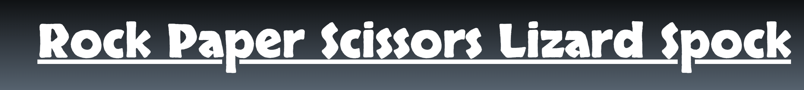
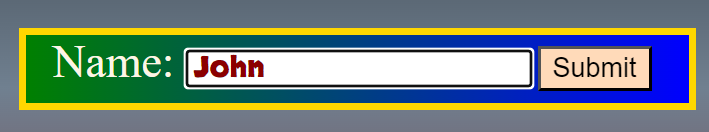
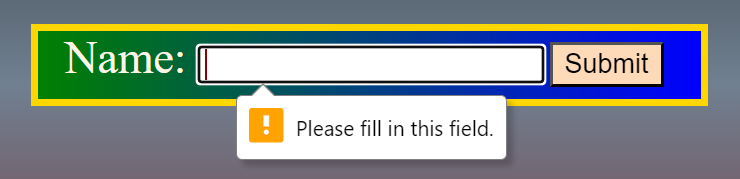
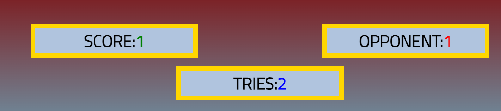

## Rock, Paper, Scicssors, Lizard, Spock

The purpose of this site is to allow more people to play the updated version of the beloved game Rock,Paper, Scissors Game, that was introduced to us thanks to the sitcom The Big Bang Theory and ,some would say, that the game has been improved upon by offering more options to try and defeat your opponent.
This game is targeted at all age groups that simply wish to pass the time with this game, challenge they're decision making skills, or introduce a new audience to the game.

# -Features

- Header
 

* The header has Skranji font to make it stand out along with the font color being white on the dark part of the background color.

- Input Box
  

  * The background of the box is a gradient color of green to blue to make it stand out, with the font being darkred colored and a font-family of Skranji would make using the box more pleasant looking than and ordinary looking box.
  
  
  - This image shows that the input field need to be written in to work.  

* Game Options

  

 - The buttons are aranged in a line for aesthetically pleasing to look at, spaced evenly. They have a background color that is closest to the choice, and an image from font awesome depicting the choice for users.

* Game Results

  

- Each box has it numerical value in differnet colors for aethestics reason along with identifying them to their indivdual positions.
- The boxes are aligned in a downward facing triangle to keep the them seperate and for aesthetic reasons.
- 
# - Technologies used

- HTML
- CSS
- JavaScript

# -Testing

- 

## Validator Testing-

- Html – Errors - [W3C validator](https://validator.we.org/)
  

  JShint- [JShint validator](https://jshint.com/)
  

CSS –[W3C validator] (<https://jigsaw.w3.org/css-validator/>)

# Deployment-

- The game was deployed to GitHub pages.
- Live link to the page can be found here -
  
## Web Browser used -

- Google Chrom
- Microsoft Edge

## Devices Used -

# Credits-

## Content-

* Inspiration for the project came from:

  - [geeksforgeeks](https://www.geeksforgeeks.org/rock-paper-and-scissor-game-using-javascript/)
  - [stackoverflow](https://stackoverflow.com/questions/22623331/rock-paper-scissors-lizard-spock-in-javascript/)
  - [CodeInstitute](https://learn.codeinstitute.net/courses/course-v1:CodeInstitute+JSE_PAGPPF+2021_Q2/courseware/30137de05cd847d1a6b6d2c7338c4655/c3bd296fe9d643af86e76e830e1470dd/)

## Media-

- Icons for buttons the buttons were taken from [FontAwesome](https://fontawesome.com/)
- Color was used from [w3school] (https://www.w3schools.com/colors/color_tryit.asp?hex=BC8F8F/),
  (https://www.w3schools.com/css/css3_gradients.asp/)
- For button positioning was looked at on [geeksforgeeks](https://www.geeksforgeeks.org/rock-paper-and-scissor-game-using-javascript/)
- Form Validation was used from [CodeInstitute](https://learn.codeinstitute.net/courses/course-v1:CodeInstitute+HE101+2020/courseware/fcc67a894619420399970ae84fc4802f/05a72bc3e032457d8a3d108d33656c72/?child=last/), (https://learn.codeinstitute.net/courses/course-v1:CodeInstitute+HE101+2020/courseware/fcc67a894619420399970ae84fc4802f/05a72bc3e032457d8a3d108d33656c72/?child=last/)
