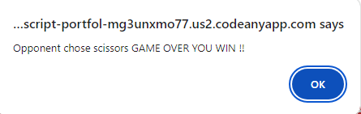

# Rock, Paper, Scicssors, Lizard, Spock

The purpose of this site is to allow more people to play the updated version of the beloved game Rock,Paper, Scissors Game, that was introduced to us thanks to the sitcom The Big Bang Theory and ,some would say, that the game has been improved upon by offering more options to try and defeat your opponent.
This game is targeted at all age groups that simply wish to pass the time with this game, challenge they're decision making skills, or introduce a new audience to the game.

## Features

- There are 2 pages to this project:

 The first page has to text boxes that show the rules and combinations that can be used in the game aswell as a input box to be used by the user to access the game. The input box is specidied to letters only and MUST be filled.

 The second page houses the game, where the user can choose any selection to try and beat the computer. There are also score boxes to show user and opponent score as well as number of tries.

### Rules Page

- Header:

- The header has Skranji font and also a font color being red to make it stand out.

- Rules Text Box:

- The text box has 4 points explaining the rules to the user should they need reminding or are new to the game.

- Choices Text Box:

- The text box shows all the combinations and are colored the same as the buttons in the game, to stand out the the user.

- Input Box:
  
- The background of the box matches the rest to keep with a consistant color. The input can also only be letters and must be filled out before proceeding.

  

- Input field content is required to be accepted.  
  

- Input field content MUST be letters only to be accepted.  
  

### Game Page

- The heading is a font of Oswald in a red color to stand out against the grey background and matching with the previous heder.

- There is a link back to the rules page incase the user is in need to remember the rules.

- The choice buttons are arranged in a line for an aesthetically pleasing look, and are spaced evenly. They have a background color that are matched with the list on the rules page, and an image from font awesome depicting the choice for users.

  
- For the results each box has its numerical value in differnet colors for aethestics reason along with identifying them to their indivdual positions.
  
- The boxes are aligned in a downward facing triangle to keep the them seperate and is also for aesthetic reasons.

- There are also alerts to inform the user of the results of their picks.

- This alert is when the users pick beats the opponents.

- This alert is for when both user and opponent pick the same option.

- This alert is when the users pick loses to the opponent.

- Another 2 alerts show when the game is over and who is the winner or loser.

- This is a win.

- This is a loss.

## Technologies used

- HTML
- CSS
- JavaScript

## Testing

- [replit.com](https://replit.com/) was used as a model to desgin and build before working on [Codeanywhere](https://app.codeanywhere.com/).

- Dev tools was used for CSS and for JavaScript functionality and appearance.

- Tested on lighthouse through Dev Tools.

- 

## Validator Testing

- Html - [W3C validator](https://validator.we.org/)
  
  

- JShint - [JShint validator](https://jshint.com/)
  
  

- CSS - [W3C validator](https://jigsaw.w3.org/css-validator/)
  

## Deployment Steps

- The game was deployed to GitHub pages.
  
- Locate **Github Repository**.
- Go to **Setting** tab.
- Select **Pages** tab on the left.
- At **Source** select **Main**
- Then click **Save**
- **Refresh** the page.

- Live link to the page can be found here -[GitHub](https://0w3nm.github.io/javascript_portfolio_2_project_rock_paper_scissors_game/)
  
## Web Browser used -

- Google Chrome
- Microsoft Edge

## Devices Used

    - 12th Gen Intel (R) Core TM i7-12700F - Desktop
    - HP EliteBook 840 G5 - Laptop

# Credits

## Content-

- When deciding to do this project i looked at multiple sources for inspiration which came from:

  - [Geeksforgeeks](https://www.geeksforgeeks.org/rock-paper-and-scissor-game-using-javascript/) as they had a fully fledge game that i could see and look at the inner workings of so that i could develop into my own creation.
  - [Stackoverflow](https://stackoverflow.com/questions/22623331/rock-paper-scissors-lizard-spock-in-javascript/) showed a more specified version of what was needed as i could learn and work that code into mine to gain similar results.
  - [CodeInstitute](https://learn.codeinstitute.net/courses/course-v1:CodeInstitute+LM101+2021_T1/courseware/2d651bf3f23e48aeb9b9218871912b2e/234519d86b76411aa181e76a55dabe70/) walkthrough project gave the stepping stones on building a project that had randomisation in it to build my project.
  
  - [W3Schools](https://www.w3schools.com/js/js_htmldom_eventlistener.asp/) helped me understand how to place event listeners on the buttons.

  - [CodeAcademy](https://www.codecademy.com/forum_questions/5198f3017773428a500017b5#:~:text=To%20colored%20just%20one%20word) helped me solve my issue of coloring indivdual words.

  - [CodeInstitute](https://learn.codeinstitute.net/courses/course-v1:CodeInstitute+HE101+2/courseware/fcc67a894619420399970ae84fc4802f/05a72bc3e032457d8a3d108d33656c72/) was also used when it came to form validation.
  - Aswell as [Stackoverflow](https://stackoverflow.com/questions/23556533/how-do-i-make-an-input-field-accept-only-letters-in-javascript) which was used and adapted to fit my projects needs.
  - I also used several locations when it came to authorisation as more learning was need on this subject:
  [W3Schools](https://www.w3schools.com/js/tryit.asp?filename=tryjs_validation_js)
  I used two sites to help on this subject [Stackoverflow](https://stackoverflow.com/questions/2018567/loading-another-html-page-from-javascrip) and also [Stackoverflow](https://stackoverflow.com/questions/23556533/how-do-i-make-an-input-field-accept-only-letters-in-javascript)
  [TestBook](https://testbook.com/web-development/how-do-i-link-a-submit-button-to-another-webpage-using-html#:~:text=In%20HTML%2C%20linking%20submit%20buttons,property%20of%20the%20Anchor%20element.)
  There was also some tutor help on [CodeInstitute](https://learn.codeinstitute.net/ci_support/diplomainsoftwaredevelopmentpredictiveanalytics/support)

- There were a number of places i went to help with breakpoint issues such as:
  [W3Schools](https://www.w3schools.com/howto/howto_css_media_query_breakpoints.asp) as this offered examples of commonly used break points along with [Slack](https://slack.com/intl/en-gb/) through message boards posting with other students and tutors.
  [GitHub](https://github.com/0w3nM/html-css-portfolio1-Moon-Landing/blob/main/assets/css/style.css) by looking at previous project i had to done to remeber what was needed and how it was done.
  - [W3Schools](https://www.w3schools.com/css/css3_gradients.asp/) was used to learn about graident colouring for backgrounds.
  - [CodeInstitute](https://learn.codeinstitute.net/courses/course-v1:CodeInstitute+HE101+2/courseware/fcc67a894619420399970ae84fc4802f/643317b091da4eef98fe9e0812a71715/) section on Form Inputs help develop an input box for this project, giving insights into what is needed.
  
  - I again used two sites to help gain more understanding on this topic through [W3Schools](https://www.w3schools.com/css/tryit.asp?filename=trycss_link_background) aswell as [W3Schools](https://www.w3schools.com/css/tryit.asp?filename=trycss_link_advanced) as they helped to style the link to the rules page.

## Media-

- Icons for the buttons were taken from [FontAwesome](https://fontawesome.com/)
  
- Color for this project was used from [W3School](https://www.w3schools.com/colors/color_tryit.asp?hex=BC8F8F/) and also [W3School](https://www.w3schools.com/css/css3_gradients.asp/)

- For button positioning [Geeksforgeeks](https://www.geeksforgeeks.org/rock-paper-and-scissor-game-using-javascript/) helped with understanding how to manage this.

- Favicon was made through the [Favicon](https://www.favicon.cc/) website.
  
- [YouTube](https://www.youtube.com/watch?v=94UM0Ss3uoU) was used from the TBS YouTube channel as another way to understand the rules.

